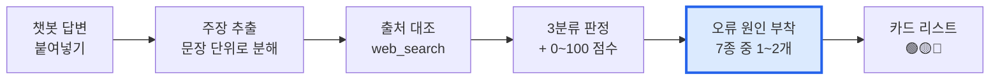

# 발표 자료 — AI 답변 신뢰도 검증기

> 슬라이드 순서대로 정리했습니다. 각 슬라이드의 **[말할 것]** 은 발표자 스크립트입니다.

---

## 슬라이드 1 — 표지

# AI 답변 신뢰도 검증기
### AI가 틀렸을 때, **왜 틀렸는지**까지 설명합니다

세부주제: 설명가능성(Explainability)

**[말할 것]**
> "저희 팀은 AI가 틀리는 걸 막는 대신, **AI가 틀렸을 때 사람이 알아챌 수 있게** 만드는 쪽을 골랐습니다."

---

## 슬라이드 2 — 문제 정의

### 할루시네이션의 진짜 문제는 "틀린다"가 아니라 "안 보인다"입니다

AI가 틀린 답을 할 때 사용자에게 두 가지가 동시에 안 보입니다.

| | 안 보이는 것 | 왜 문제인가 |
|---|---|---|
| **1** | 틀렸다는 **사실** | 할루시네이션은 문법도 자연스럽고 어조도 확신에 차 있습니다. 맞는 답과 겉모습이 똑같습니다. |
| **2** | 왜 틀렸는지 **이유** | "이건 틀렸습니다"만 들으면 사용자는 다음에 같은 함정을 다시 밟습니다. |

**[말할 것]**
> "여러분이 AI에게 '훈민정음 해례본 어디 있어?'라고 묻고 '국립중앙박물관'이라는 답을 받았다고 해봅시다.
> 이게 틀렸다는 걸 어떻게 아시겠습니까? 문장은 완벽합니다. 확신에 차 있습니다.
> 그리고 설령 틀렸다는 걸 알았다 해도, **왜** 틀렸는지 모르면 다음 질문에서 또 당합니다."

#### 심사 근거: 이건 국가 전략이 예산을 배정한 기술 축입니다

과기정통부 「신뢰할 수 있는 인공지능 실현전략」(2021)은 3대 전략·10대 실행과제 아래
**설명가능성 · 공정성 · 견고성**을 AI 신뢰성 확보의 3대 기술 요소로 지목하고,
2022–2026년 5년간 **설명가능성 분야에 약 450억 원**의 R&D 예산 지원 계획을 밝혔습니다.

> 발표 전 [원문 출처](https://www.aitimes.com/news/articleView.html?idxno=138536)를 직접 열어 표현을 확인하세요.
> **사실 검증 도구의 발표 자료에 미확인 인용이 들어가면 그 자체가 자기모순입니다.**

---

## 슬라이드 3 — 기존 사례와의 차별점

### 같은 축, 다른 지점

2026년 1월 AI 신뢰성 해커톤 '트라이톤'에서 본선을 통과한 팀 다수가 **낚시성·유해 콘텐츠 필터링** 방향이었습니다.
*(이 배경은 팀에서 조사한 내용입니다. 발표 전 출처를 확보해 두세요.)*

```
       [ 콘텐츠를 걸러낸다 ]              [ 답변을 설명한다 ]
              ↑                                  ↑
        기존 필터링 서비스                    이 프로젝트
        "이건 위험합니다"              "이 문장이 틀렸고, 이유는 이것입니다"
```

| | 기존 필터링 접근 | 일반 팩트체크 도구 | **이 프로젝트** |
|---|---|---|---|
| 판정 단위 | 콘텐츠 전체 | 답변 전체 | **문장 단위 사실 주장** |
| 판정 종류 | 위험 / 안전 (2분류) | 참 / 거짓 (2분류) | **근거있음 / 불충분 / 상충 (3분류)** |
| "확인 안 됨" 처리 | — | 대개 "거짓"으로 합침 | **별도 분류로 분리** |
| **오류 원인 설명** | 없음 | 없음 | **7종 원인 후보 + 가능성 %** |

**[말할 것]**
> "차별점은 두 가지입니다.
> 첫째, **'확인 안 됨'과 '틀림'을 분리**했습니다. 이 둘을 합치면 검증 도구 자체가 할루시네이션을 하게 됩니다.
> 둘째, 저희가 유일하게 답하는 질문은 **'왜 이렇게 답했나'** 입니다. 이게 설명가능성의 핵심입니다."

---

## 슬라이드 4 — 작동 원리



### 판정 3분류

| 판정 | 점수대 | 색 |
|---|---|---|
| 근거 있음 | 70–100 | 🟢 |
| 근거 불충분 | 30–69 | 🟡 |
| 상충함 | 0–29 | 🔴 |

### 오류 원인 7종 — **이 슬라이드가 핵심입니다**

| 코드 | 라벨 |
|---|---|
| `knowledge_cutoff` | 학습 시점 이후 변경 |
| `entity_confusion` | 유사 대상과 혼동 |
| `question_ambiguity` | 질문 모호성으로 인한 오독 |
| `overgeneralization` | 과잉 일반화 |
| `fabricated_specifics` | 세부 정보 지어냄 |
| `source_conflict` | 출처 간 불일치 |
| `unverifiable_by_nature` | 원리상 검증 불가 |

**[말할 것]**
> "원인을 **자유 서술이 아니라 7종 닫힌 집합**으로 만든 게 설계상 중요한 결정이었습니다.
> 매번 다른 표현이 나오면 화면에 아이콘도 못 붙이고, '이 챗봇은 학습 시점 문제가 몇 %'라는 통계도 못 냅니다."

### 엔지니어링 판단 두 가지 (질문 나오면 답할 것)

**① 총점은 모델이 준 값을 안 씁니다. 코드가 다시 계산합니다.**
LLM은 "상충함인데 신뢰도 85점" 같은 모순된 값을 실제로 뱉습니다.
판정을 기준으로 점수를 밴드에 강제로 밀어넣고(`clampScoreToVerdict`), 총점은 코드가 계산합니다.

**② 상충 주장이 하나라도 있으면 총점 상한 49점.**
"10개 중 9개 맞았으니 90점"이라는 착시를 막습니다. 사실 확인에서는 틀린 주장 하나가 답변 전체의 인용 가능성을 무너뜨립니다.

---

## 슬라이드 5 — 실제로 잡아낸 오류

### 시연: 노벨상 예시 (총점 **39/100**)

| # | 주장 | 판정 | 점수 | 붙은 원인 |
|---|---|---|---|---|
| 1 | 마리 퀴리는 노벨 **물리학상**을 두 번 수상했습니다 | 🔴 상충함 | 15 | 유사 대상과 혼동 (90%) |
| 2 | 존 바딘은 1956·1972년 물리학상을 두 번 받았습니다 | 🟢 근거 있음 | 97 | — |
| 3 | 아인슈타인도 상대성 이론과 광전 효과로 두 차례 수상 | 🔴 상충함 | 5 | 과잉 일반화 (80%) · 세부 정보 지어냄 (65%) |

**1번에 대한 설명 출력 (그대로 읽기):**
> "퀴리는 1903년 **물리학상**, 1911년 **화학상**으로 서로 다른 분야에서 두 번 수상했습니다."
> **왜 이렇게 답했나 —** "'퀴리 = 노벨상 2회'와 '질문 = 물리학상 2회'라는 두 패턴이 겹치면서, 분야가 다르다는 결정적 차이가 뭉개졌습니다. 질문의 조건에 맞춰 사실을 끌어다 맞춘 형태입니다."

### 다른 4개 예시

| 예시 | 심어둔 오류 | 대표 원인 |
|---|---|---|
| 훈민정음 | 해례본 소장처(간송미술관→국립중앙박물관), 창제 당시 글자 수(28자→24자) | 유사 대상과 혼동 |
| 파이썬 최신 버전 | 낡은 "최신" 버전, 일어나지 않은 GIL 제거 | 학습 시점 문제 |
| 가장 높은 산 | "우리나라" 범위가 모호한데 한쪽으로 단정 | 질문 모호성 |
| 비타민C와 감기 | 연구 결론 뒤집기, 무조건적 안전성, 주관적 서술 | 과잉 일반화 |

**[말할 것]**
> "**가장 높은 산** 예시를 보시면, 답변이 완전히 틀린 게 아닙니다. '한반도에서'라고 했으면 맞습니다.
> 질문의 '우리나라'가 모호했고, AI가 되묻지 않고 한쪽으로 단정한 게 문제입니다.
> **이런 종류의 오류는 '참/거짓' 2분류로는 설명이 안 됩니다.**"

### 코드 품질 근거

- **85개 단위 테스트 전부 통과** (`npm test`)
- fixture의 **기대 판정값 자체가 테스트로 고정**되어 있어, 점수 규칙을 건드리면 데모가 조용히 망가지는 대신 테스트가 깨집니다
- 개발 중 테스트가 실제 버그 하나를 잡았습니다 — 근거 없는 빈 출처를 걸러내야 할 가드가 기본값 때문에 무력화되어 있던 문제

---

## 슬라이드 6 — 확장 가능성

| 단계 | 무엇을 | 왜 지금은 안 했나 |
|---|---|---|
| **바로 다음** | 백엔드 분리 — API 키를 서버로 | 현재는 브라우저 번들에 키가 노출됩니다. 배포하려면 필수입니다. |
| | 브라우저 확장 — ChatGPT·Claude 화면에서 우클릭 검증 | 복붙 단계를 없애는 게 실사용의 최대 장벽입니다. |
| **중기** | 원인 통계 대시보드 — "이 챗봇은 학습 시점 오류가 34%" | 원인을 닫힌 집합으로 만든 이유가 여기 있습니다. |
| | 도메인 특화 출처 — 의료(PubMed)·법률(국가법령정보센터) 연결 | 지금은 일반 웹 검색이라 전문 분야 정확도가 낮습니다. |
| **장기** | 교육용 모드 — 학생이 먼저 판정해보고 정답과 비교 | AI 리터러시 교육 도구로. 원인 분류 7종이 그대로 교육 커리큘럼이 됩니다. |
| | 모델 벤치마크 — 같은 질문에 여러 모델을 붙여 신뢰도 비교 | 판정 파이프라인이 모델과 분리되어 있어 구조적으로 가능합니다. |

**[말할 것]**
> "가장 중요한 확장은 **원인 통계**입니다.
> 개별 답변을 검증하는 데서 끝나지 않고, '이 서비스의 오류는 주로 어떤 종류인가'를 누적하면
> 모델 개선과 규제 양쪽에 쓸 수 있는 데이터가 됩니다. 저희가 원인을 자유 서술로 두지 않은 진짜 이유입니다."

---

## 슬라이드 7 — 한계 (먼저 말할 것)

> 질문 받고 방어하지 말고, **먼저 말하는 게 신뢰를 얻습니다.** 사실 검증 도구라면 더욱 그렇습니다.

- **검증기 자체가 언어모델입니다.** 판정하는 모델도 틀릴 수 있습니다. 이건 "정답 기계"가 아니라 **"의심할 지점을 찾아주는 도구"**입니다.
- **원인 분류는 추정입니다.** 모델 내부를 들여다본 게 아니라 **패턴에 근거한 가설**입니다. 가능성을 %로 표시한 것도 그래서입니다.
- **실시간 정보와 주관적 판단이 섞인 주장에 약합니다.** 검색을 끄면 검증기도 같은 학습 시점 문제를 물려받습니다.
- **의료·법률 판단에 쓰면 안 됩니다.**
- **현재 구조로 배포하면 API 키가 유출됩니다.** 로컬 데모 전용입니다.

**[말할 것]**
> "저희 도구도 틀릴 수 있습니다. 그래서 판정마다 **'무엇과 대조했는지'와 출처 링크를 반드시 함께 출력**합니다.
> 사용자가 저희를 믿는 게 아니라, **저희가 보여준 출처를 직접 확인할 수 있게** 만드는 것 —
> 그게 저희가 생각하는 설명가능성입니다."

---

## 발표 전 체크리스트

- [ ] `npm install` → `npm test` (85개 통과 확인)
- [ ] `npm run dev` → 저장된 예시 5개 모두 클릭해서 렌더 확인
- [ ] **실시간 모드를 실제 API 키로 한 번 돌려보기** — 개발 중에는 키가 없어 fixture 경로만 검증했습니다
- [ ] 실시간 모드로 노벨상 예시를 넣어 fixture와 비슷한 판정이 나오는지 확인 (슬라이드 5의 신뢰도가 여기 달려 있습니다)
- [ ] 발표장 네트워크 확인 → 불안하면 **fixture 모드로만 시연** (그래서 만든 기능입니다)
- [ ] 과기정통부 인용 원문 확인
- [ ] '트라이톤' 해커톤 배경 출처 확보
