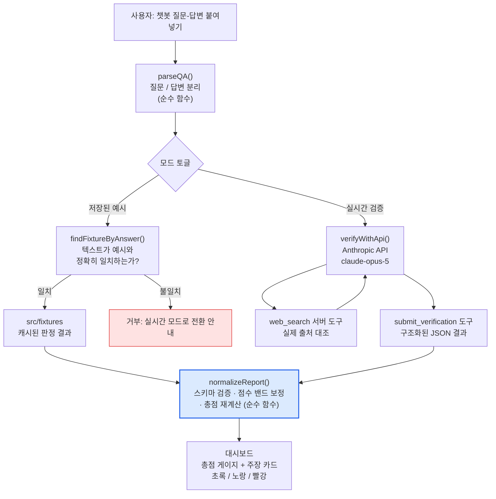

# AI 답변 신뢰도 검증기

> AI가 틀렸을 때, **왜 틀렸는지**까지 설명하는 웹 앱
> 해커톤 「신뢰할 수 있는 AI와 함께 만들어가는 미래 사회」 — 세부주제: **설명가능성(Explainability)**

생성형 AI의 답변을 붙여넣으면 **문장 단위 사실 주장으로 쪼개고**, 각 주장을 출처와 대조해
`근거 있음 / 근거 불충분 / 상충함`으로 판정하고, 틀린 주장에는 **AI가 왜 그렇게 답했는지 원인 후보**를 붙입니다.

---

## 1. 문제의식

생성형 AI가 틀린 답을 할 때, 사용자에게는 두 가지가 동시에 안 보입니다.

1. **틀렸다는 사실**이 안 보입니다. 할루시네이션은 문법도 자연스럽고 어조도 확신에 차 있어서, 맞는 답과 겉모습이 똑같습니다.
2. **왜 틀렸는지**가 안 보입니다. "이건 틀렸습니다"라는 경고만 받으면 사용자는 다음에 같은 함정을 다시 밟습니다.

기존 팩트체크 도구 대부분은 1번까지만 합니다. 이 프로젝트는 **2번을 핵심 기능으로 올린 것**이 차별점입니다.
"틀렸다"가 아니라 **"이 문장은 학습 시점 이후 바뀐 정보라서 틀렸고, 모델은 학습 데이터에서 가장 흔한 값을 가져온 것으로 보인다"**까지 말합니다.

### 심사 근거: 설명가능성은 국가 AI 정책의 명시적 기술 축

과학기술정보통신부 「신뢰할 수 있는 인공지능 실현전략」(2021)은 3대 전략·10대 실행과제 아래
**설명가능성 · 공정성 · 견고성**을 인공지능 신뢰성 확보를 위한 3대 기술 요소로 지목하고,
2022–2026년 5년간 설명가능성 분야에 약 450억 원, 공정성 분야에 약 200억 원의 R&D 예산 지원 계획을 밝혔습니다.

즉 이 프로젝트가 다루는 설명가능성은 학술적 관심사가 아니라 **국가 전략이 예산을 배정한 기술 축**입니다.

- [과기정통부, '신뢰할 수 있는 AI' 실현 전략 발표 (AI타임스)](https://www.aitimes.com/news/articleView.html?idxno=138536)
- [정부, 3대 전략 10대 실천과제 제시 (인공지능신문)](http://www.aitimes.kr/news/articleView.html?idxno=21024)
- [「신뢰할 수 있는 인공지능 실현전략」 요약 (법무법인 뉴스레터 PDF)](http://www.shinkim.com/newsletter/2021/GA/2021_vol85/links/2021_vol85_101.pdf)

> 발표 전에 위 출처를 직접 열어 원문 표현을 한 번 확인하세요. **사실 검증 도구의 발표 자료에 미확인 인용이 들어가면 그 자체가 자기모순입니다.**

---

## 2. 아키텍처



### 설계에서 중요한 두 가지

**① fixture 모드와 실시간 모드가 같은 `normalizeReport()`를 통과합니다.**
데모용 별도 경로를 만들면 "발표에서는 되는데 실제로는 안 되는" 앱이 됩니다.
fixture 데이터도 실시간 응답과 똑같이 정규화를 거치므로, 점수 규칙을 바꾸면 양쪽에 동시에 반영됩니다.

**② 모델이 준 총점을 쓰지 않고 항상 다시 계산합니다.**
LLM은 "상충함인데 신뢰도 85점" 같은 모순된 값을 실제로 뱉습니다.
판정을 기준으로 점수를 밴드에 강제로 밀어넣고(`clampScoreToVerdict`), 총점은 코드가 계산합니다.

**③ 모델이 제출한 출처 URL도 그대로 믿지 않습니다.**
`submit_verification` 도구의 `evidence.url`은 모델이 자유 텍스트로 채우는 필드라서, 스키마상으로는 유효해도
실제로 `web_search`가 반환한 적 없는 URL을 그럴듯하게 지어낼 수 있습니다("환각 출처로 환각을 검증하는" 자기모순).
그래서 `verify.ts`가 각 턴의 `web_search_tool_result` 블록에서 실제로 검색된 URL만 따로 모으고(`collectSearchedUrls`),
`normalize.ts`가 `evidence.url`을 그 집합과 대조합니다. 집합에 없는 URL은 링크를 제거하고 카드에 **"⚠ 미확인 출처"**로
표시합니다(제목·인용문은 남겨서 근거 자체를 숨기지는 않습니다). 웹 검색을 꺼둔 경우 이 집합은 항상 비어 있으므로,
그 모드에서 나온 URL은 전부 미확인으로 표시됩니다 — 검색 없이는 코드가 어떤 URL의 실재도 확인할 방법이 없기 때문입니다.

### 폴더 구조

```
src/
├── lib/                    ← 순수 로직 (전부 단위 테스트 있음)
│   ├── types.ts            앱 전체가 공유하는 데이터 모양
│   ├── parseQA.ts          붙여넣은 텍스트 → 질문/답변 분리
│   ├── scoring.ts          점수 밴드 · 총점 규칙 · 색상 매핑
│   ├── normalize.ts        LLM 출력 → 믿고 쓸 수 있는 Report
│   ├── fixtureMatch.ts     입력이 저장된 예시와 같은지 판별
│   ├── prompt.ts           시스템 프롬프트 + 결과 제출 도구 스키마
│   └── verify.ts           Anthropic API 호출 (유일하게 부수효과 있는 파일)
├── fixtures/               ← 오류를 일부러 섞은 예시 5개 + 기대 판정
├── components/             ← InputPanel · ScoreSummary · ClaimCard
└── App.tsx                 상태 배선
```

---

## 3. 판정 체계

### 3분류 판정과 점수 밴드

| 판정 | 의미 | 점수대 | 색 |
|---|---|---|---|
| `supported` | 신뢰할 만한 출처로 확인됨 | 70–100 | 🟢 초록 |
| `insufficient` | 확인할 근거를 못 찾음 / 출처가 불충분 | 30–69 | 🟡 노랑 |
| `contradicted` | 신뢰할 만한 출처와 명백히 어긋남 | 0–29 | 🔴 빨강 |

**"확인 안 됨"과 "틀림"을 분리한 것이 핵심입니다.** 이걸 합치면 검증 도구 자체가 할루시네이션을 하게 됩니다.

**총점 규칙:** 주장 점수의 평균. 단 **상충 주장이 하나라도 있으면 총점 상한 49점.**
"10개 중 9개 맞았으니 90점"이라는 착시를 막기 위한 규칙입니다. 사실 확인에서는 틀린 주장 하나가 답변 전체의 인용 가능성을 무너뜨립니다.

### 오류 원인 분류 7종

`supported`가 아닌 주장에만 부착합니다. **자유 서술이 아니라 닫힌 집합**으로 둬서, UI 매핑과 통계 집계가 가능하게 했습니다.

| 코드 | 라벨 | 언제 붙는가 |
|---|---|---|
| `knowledge_cutoff` | 학습 시점 이후 변경 | "최신 버전", "현재 대통령" 등 시점 의존 정보 |
| `entity_confusion` | 유사 대상과 혼동 | 비슷한 인물/기관/사건을 뒤바꿈 |
| `question_ambiguity` | 질문 모호성으로 인한 오독 | 질문이 두 가지로 읽히는데 되묻지 않고 한쪽으로 단정 |
| `overgeneralization` | 과잉 일반화 | 제한적 연구 결과를 단정적 결론으로 확대 |
| `fabricated_specifics` | 세부 정보 지어냄 | 숫자·날짜·고유명사를 그럴듯하게 채워 넣음 |
| `source_conflict` | 출처 간 불일치 | 학술 문헌과 대중 콘텐츠가 정반대를 말하는 주제 |
| `unverifiable_by_nature` | 원리상 검증 불가 | 주관적 느낌, 미래 예측 |

---

## 4. 실행 방법

### 필요한 것

- Node.js 20 이상 (개발 환경 검증: v24.19.0, npm 11.17.0)

### 설치와 실행

```bash
npm install
```

```bash
npm run dev
```

브라우저에서 http://localhost:5173 을 엽니다.
**API 키가 없어도 "저장된 예시" 모드로 모든 기능을 시연할 수 있습니다.**

### 실시간 검증을 쓰려면

`.env.example`을 복사해 `.env`를 만들고 [Anthropic Console](https://console.anthropic.com/settings/keys)에서 발급한 키를 넣습니다.

```bash
cp .env.example .env
```

```
VITE_ANTHROPIC_API_KEY=sk-ant-...
```

키를 넣은 뒤에는 **개발 서버를 껐다 다시 켜야** 합니다 (Vite는 시작할 때 `.env`를 읽습니다).

### 테스트

```bash
npm test
```

`src/lib`의 순수 함수와 fixture 데이터에 대한 **85개 테스트**가 돕니다.
fixture의 기대 판정값 자체가 테스트로 고정되어 있어서, 점수 규칙을 건드리면 데모가 조용히 망가지는 대신 테스트가 깨집니다.

### 빌드

```bash
npm run build
```

---

## 5. 한계점

발표 때 숨기지 말고 먼저 말할 내용입니다.

### 정확도의 한계

- **검증기 자체가 언어모델입니다.** 판정하는 모델도 틀릴 수 있습니다. 이 도구는 "정답 기계"가 아니라 **"의심할 지점을 찾아주는 도구"**입니다. 최종 판단은 사람이 원 출처를 열어 확인해야 합니다.
- **실시간 정보에 약합니다.** 웹 검색을 켜도 검색 결과의 품질에 좌우됩니다. 검색을 끄면 검증 모델 자신의 학습 시점 문제를 그대로 물려받습니다 — 검증기가 같은 이유로 틀릴 수 있습니다.
- **주관적 판단에 약합니다.** "좋다", "효과적이다" 같은 서술은 `unverifiable_by_nature`로 분류되지만, 사실 주장과 가치 판단이 한 문장에 섞이면 분리가 완벽하지 않습니다.
- **한국어 고유 영역, 최신 국내 이슈, 전문 분야**(의료·법률)에서는 정확도가 눈에 띄게 떨어집니다. **의료·법률 판단에 이 도구를 쓰지 마세요.**
- **URL 대조는 "검색된 적 있는 URL인가"만 확인합니다.** `evidence.url`이 실제 `web_search` 결과 목록에 있었는지는
  코드가 대조하지만, 그 URL의 페이지에 `snippet`으로 인용된 내용이 정말 적혀 있는지까지는 확인하지 않습니다.
  즉 모델이 진짜 URL을 진짜로 검색해놓고 그 내용은 왜곡해서 인용할 가능성은 이 안전장치로 막지 못합니다.
- **원인 분류는 추정입니다.** "AI가 왜 이렇게 답했는가"는 모델 내부를 들여다본 결과가 아니라 **패턴에 근거한 그럴듯한 가설**입니다. 확률로 표시(`가능성 80%`)한 것도 그래서입니다. 실제 어텐션이나 학습 데이터를 분석한 것이 아닙니다.

### 구현상의 한계

- **API 키가 브라우저 번들에 들어갑니다.** Vite의 `VITE_` 접두사 변수는 클라이언트 코드에 그대로 박히고, SDK도 `dangerouslyAllowBrowser: true`로 켜 두었습니다. **로컬 데모 전용입니다. 이 상태로 배포하면 키가 유출됩니다.** 실제 서비스로 만들려면 API 호출을 백엔드로 옮기고 키를 서버에만 두어야 합니다.
- **한 번에 8000자까지**만 검증합니다. 긴 문서는 잘라서 넣어야 합니다.
- **주장 최대 12개**까지만 추출합니다.
- **결과를 저장하지 않습니다.** 새로고침하면 사라집니다 (DB 없는 단일 페이지 앱).
- **fixture 모드는 저장된 예시와 텍스트가 정확히 일치할 때만** 결과를 냅니다. 예시를 한 글자라도 고치면 거부합니다 — 옛 판정을 새 텍스트에 대한 판정인 것처럼 보여주는 것은 이 도구가 막으려는 바로 그 행동이기 때문입니다.
- **오류 원인 7종은 저희가 정한 분류**입니다. 학계의 표준 분류 체계가 아닙니다.

---

## 6. 기술 스택

| 항목 | 선택 | 이유 |
|---|---|---|
| 프레임워크 | React 19 + Vite | 서버 없이 `npm run dev` 하나로 뜸 |
| 언어 | TypeScript | 판정 결과의 데이터 모양을 타입으로 강제 |
| 스타일 | Tailwind CSS v4 | 설정 파일 없이 `@import "tailwindcss"` 한 줄 |
| AI 판정 | Anthropic API (`claude-opus-5`) | 서버측 `web_search` 도구로 실제 출처 대조 가능 |
| 테스트 | Vitest | Vite와 설정 공유 |
| 백엔드 / DB | **없음** | 해커톤 발표용이라 의도적으로 뺌 |
